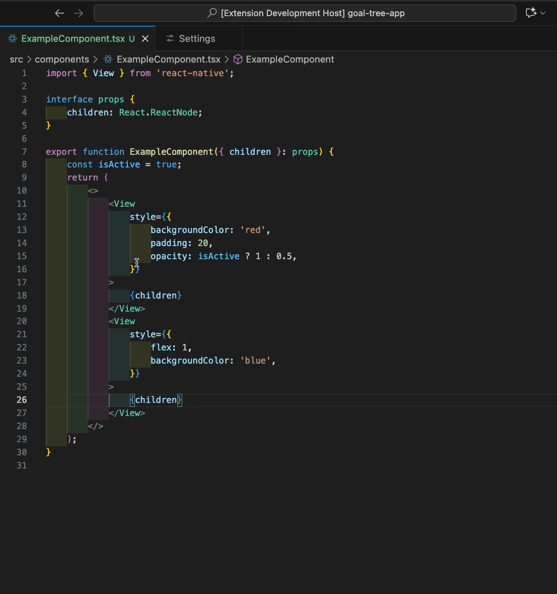
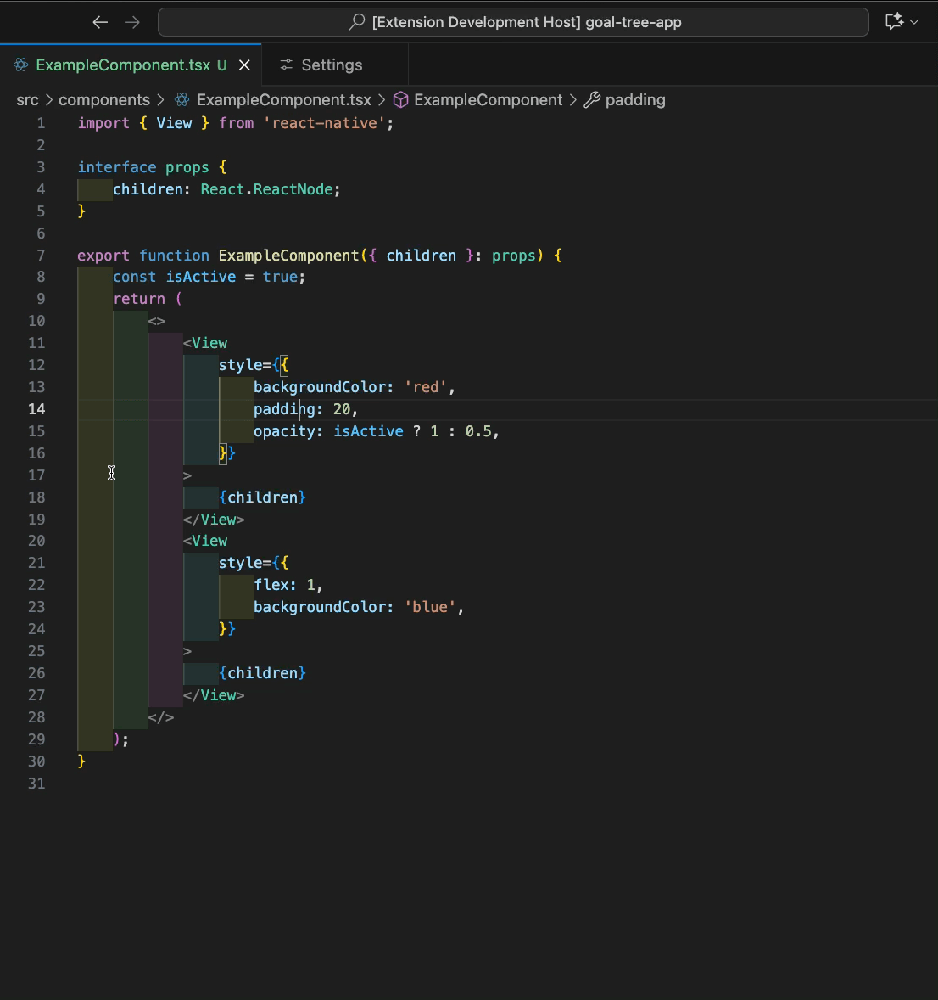

# React Native StyleSheet Extraction

[](https://marketplace.visualstudio.com/items?itemName=mikeheddo.rn-stylesheet-extraction)
[](https://marketplace.visualstudio.com/items?itemName=mikeheddo.rn-stylesheet-extraction)

**Transform your React Native development workflow** with intelligent style extraction that automatically separates static and dynamic properties, preserves comments, and maintains perfect code formatting.

> 🚀 **Stop writing repetitive StyleSheet code** - Extract inline styles with a single click and let the extension handle the complexity

## ✨ Why This Extension?

### 🎯 **Intelligent Style Processing**

Unlike simple text replacements, this extension uses **advanced AST parsing** to understand your code structure:

- **🧠 Smart Static/Dynamic Separation**: Automatically identifies `backgroundColor: 'red'` (static) vs `opacity: isVisible ? 1 : 0` (dynamic)
- **🔍 Context-Aware Detection**: Knows whether your cursor is in a style attribute, JSX element, or nested object
- **🎨 Complex Expression Support**: Handles ternary operators, function calls, and nested objects flawlessly
- **💬 Comment Preservation**: Maintains all your comments (inline, block, multi-line) with proper positioning
- **⚡ Bulk Operations**: Extract all inline styles in a file instantly
- **🔄 Array Style Support**: Works with `style={[styles.base, { dynamic: value }]}` patterns
- **📦 Auto-Import Management**: Intelligently adds/updates StyleSheet imports
- **🎯 Smart Naming**: Generates unique names with conflict detection
- **⚙️ Highly Configurable**: 7+ settings to customize behavior
- **🧪 Battle-Tested**: 100+ comprehensive tests ensure reliability

## 🏃 **Quick Start**

### Method 1: Right-Click Context Menu

1. **Select** any JSX element with inline styles
2. **Right-click** → "Extract Style(s) from View(s) to StyleSheet.create"
3. **Choose** single extraction or extract all styles
4. **Done!** Your styles are now optimized

### Single Style Extraction



### Extract All Styles



### Method 2: Keyboard Shortcuts

- **⌘⇧E** (Mac) / **Ctrl+Shift+E** (Win/Linux): Extract single style
- **⌘⇧A** (Mac) / **Ctrl+Shift+A** (Win/Linux): Extract all styles

### Method 3: Command Palette

- **⌘⇧P** → "Extract Selected Style" or "Extract All Styles"

## 📋 **Real-World Examples**

### Basic Extraction

**Before:**

```jsx
<View
	style={{
		backgroundColor: 'red',
		padding: 20,
		opacity: isActive ? 1 : 0.5,
	}}
>
	<Text style={{ fontSize: 16, color: darkMode ? '#fff' : '#000' }}>Hello</Text>
</View>
```

**After (with preserved dynamic properties):**

```jsx
<View
	style={[
		styles.myStyle1,
		{
			opacity: isActive ? 1 : 0.5,
		},
	]}
>
	<Text
		style={[
			styles.myStyle2,
			{
				color: darkMode ? '#fff' : '#000',
			},
		]}
	>
		Hello
	</Text>
</View>;

const styles = StyleSheet.create({
	myStyle1: {
		backgroundColor: 'red',
		padding: 20,
	},
	myStyle2: {
		fontSize: 16,
	},
});
```

## ⚙️ **Configuration**

Customize the extension's behavior in VS Code settings:

```json
{
	"rnStylesheetExtraction.defaultStyleName": "myStyle",
	"rnStylesheetExtraction.preferredStyleSheetName": "styles",
	"rnStylesheetExtraction.autoImportStyleSheet": true,
	"rnStylesheetExtraction.sortStyleProperties": false,
	"rnStylesheetExtraction.preserveComments": true,
	"rnStylesheetExtraction.extractionLocation": "Bottom", // "Top" | "After imports"
	"rnStylesheetExtraction.showContextMenu": true
}
```

## 🎯 **Perfect For**

- **React Native Developers** migrating from inline styles
- **Teams** standardizing on StyleSheet patterns
- **Code Reviews** improving style organization
- **Performance Optimization** reducing inline style overhead
- **Refactoring** large codebases with mixed style patterns

## � **Requirements**

- **VS Code**: 1.104.0 or higher
- **Languages**: JavaScript, JSX, TypeScript, TSX
- **Projects**: React Native applications

## 🐛 **Known Limitations**

- **Decorators**: Shows parse warnings but continues gracefully
- **Extremely Complex Expressions**: Very rare edge cases may need manual review
- **Non-React Native**: Designed specifically for React Native StyleSheet patterns

## 🤝 **Contributing**

Found a bug or want to contribute?

- 🐛 **Bug Reports**: [GitHub Issues](https://github.com/mheddo/rn-stylesheet-extraction/issues)
- 💡 **Feature Requests**: Share your ideas
- 🔧 **Pull Requests**: Help improve the extension

## 📄 **License**

This extension is released under the MIT License.

---

_Stop writing repetitive StyleSheet code and let intelligent automation handle the complexity._

**Transform your React Native workflow today!** 🚀
